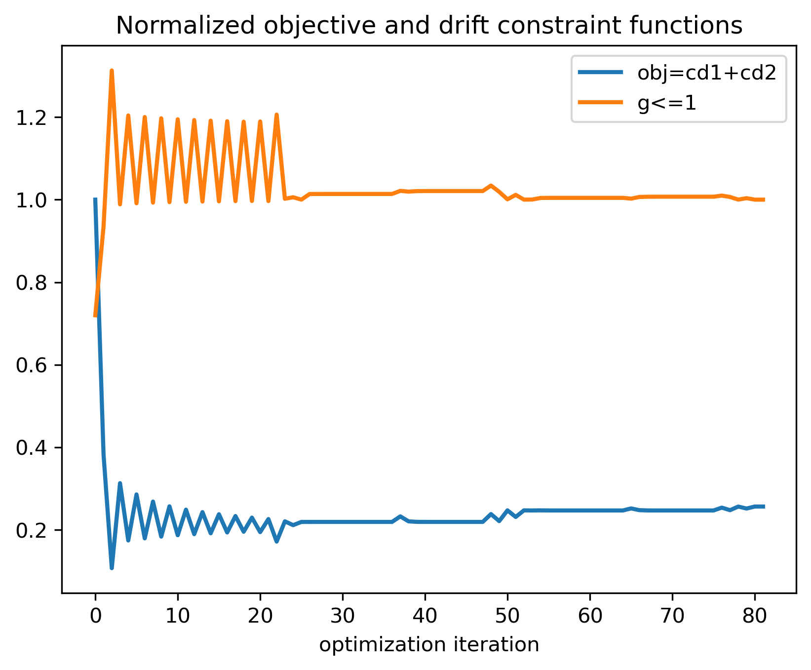

# Gradient-based transient optimization of added fluid viscous dampers for seismic retrofitting in Python    

Gradient-based optimization of added fluid viscous dampers for the seismic retrofitting of a 2D shear frame with two degrees of freedom.     
Both the dampers and the structure have a linear behavior.     

The structural response is calculated with a linear time-history analysis.   
The maximum peak drift in time is constrained to a maximum allowed value (9 mm).  
The structure is subjected to a realistic ground acceleration record (El Centro).   

The gradient is calculated with an adjoint method.  
For details on the response and adjoint sensitivity analyses see:  

> [Pollini, N. (2020). Fail‐safe optimization of viscous dampers for seismic retrofitting.  
Earthquake Engineering & Structural Dynamics, 49(15), 1599-1618.](https://onlinelibrary.wiley.com/doi/full/10.1002/eqe.3319)
  
  
### Main file to run the optimization: SciPy_OPT.py   

   

  
